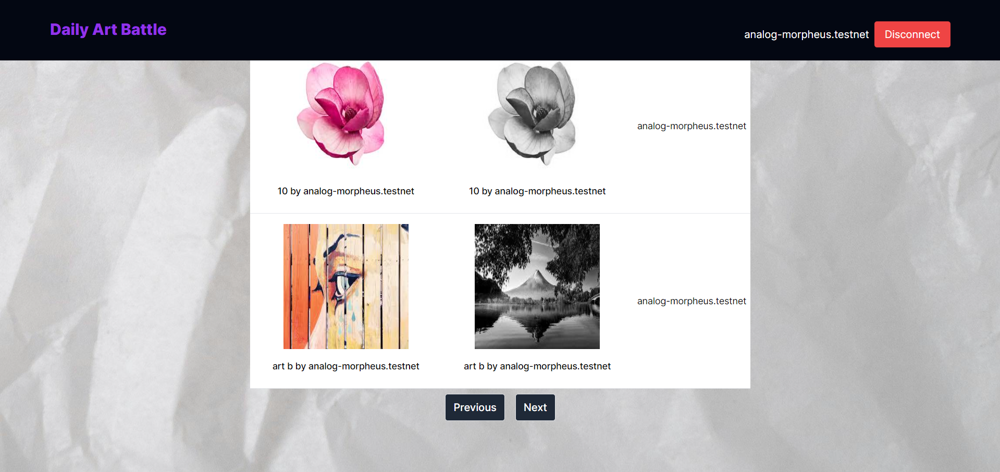

# Daily Art Battle


This project introduces a Daily Art Battle (DAB), an unique platform where art enthusiasts can engage in daily art showdowns, vote for their favourite pieces, and earn exclusive NFT rewards. DAB aims to automate the process of art battles, mint NFTs for participants, and encourage continuous engagement through a rewarding mechanism.


[](https://testnet-daily-art-battle.vercel.app/)
[](https://vercel.com/new/clone?repository-url=https://github.com/Teckas-Technologies/daily-art-battle)

**Tooling:**

[](#)
[](#)
[](#)

**Author:**

[](https://www.linkedin.com/company/teckas/) [](https://teckastechnologies.com/)

## Description

Daily art battle will automate the process of voting for art pieces, minting NFTs for participants, and incentivizing continuous engagement through a unique reward mechanism. The concept, titled ""Daily Art Battle"" (DAB), pits two pieces of art (A vs B) against each other, with the community voting for their favourite. Winners and participants receive NFT rewards based on the outcome and their participation streak.

Check out the video bellow:

[](./public/images/demo.mp4)


[](https://testnet-daily-art-battle.vercel.app/)

## Project Walkthrough
There are two kinds of participants in this application:
- Artists: Who create the art and upload it to the platform.
- Audience: Who cast their votes for the artworks and give upvotes to upcoming arts.


## Key Features
### For Artists

1. **Upload Art:** 
   - Artists can upload their art for the battle. They need to upload two versions:
     - **Unique Rare:** This is the highest quality version of the art and will be minted as a single edition (1:1). It will be awarded to one lucky winner who picks this art in the battle.
     - **Derivative Edition:** This version will be given as a participation reward to everyone who picks the artist's art in the battle. It should be a derivative of the Unique Rare, with variations such as grayscale, glitched, watermarked, etc.
   - **Art Title:** Artists must enter a title for their artwork. This title will appear on the site and in the participants' wallets.


**For Audience:**
1. **Join the Battle:**
Audience members can join the battle by connecting their NEAR wallet.

2. **Vote for Art:**
 Participants can vote for their favourite art in the battle. They are allowed to vote for only one piece in each battle.
3. **Upvote System:**
 The audience can upvote the art. Battles will be created based on the upvote count of the artworks.
4. **Receive Rewards:**
   - **Derivative Edition:**
 Everyone who votes for a particular art will receive this version as a participation reward.
   -   **Unique Rare:**
A single winner will be randomly selected to receive the Unique Rare edition without any specific criteria. 

### User Flow

**Artist Registration:**
- Artists sign up and connect their NEAR wallet.
- They upload two versions of their art (Unique Rare and Derivative Edition) and enter the title.

**Art Display:**
- Uploaded art is displayed on the platform for the community in upcoming art’s to view and upvote.
- The art which has more upvote count will be listed on the top of the list.


**Battle Creation:**
- Battles are created based on the upvote count of the artworks. Two pieces of art with the highest upvotes will face off in a battle.
- The audience can able to upvote for each at one time.
- Battles will be created for a day one battle and once battle is completed then only new battles will be created.


**Audience Participation:**
- The audience connects their NEAR wallet to join the battle.
- Participants vote for their favourite art in the battle for one time.

**Voting and Rewards:**
- Votes are tallied, and the winner is determined.
- All participants who voted for an art receive the Derivative Edition of that art.
- One randomly selected participant who voted for the winning art receives the Unique Rare edition.

### Conclusion

Daily Art Battle (DAB) offers a unique and engaging way for artists to showcase their work and for the audience to interact with and support their favorite art pieces. By leveraging NFTs, DAB not only brings a new dimension to art competitions but also provides tangible rewards for participation, fostering a vibrant and interactive community. Join DAB today and be a part of the future of art competitions!

## Step By Step

To getting start with daily art battle you need to follow these steps.

1. **Clone repository**
```bash
git clone https://github.com/Teckas-Technologies/daily-art-battle
cd daily-art-battle
```
2. **Install dependencies**
```bash
pnpm install
pnpm run dev
```

3. **Connect with wallet**
If you want to partcipate in battle firstly you should connect with your near wallet to the daily art battle


4. **Upload ArtWork** 
Once you sucessfully connected next you able to upload your art work


5. **Upvote for art**
The audience can upvote the art. Battles will be created based on the upvote count of the artworks.


6. **Vote for art**
Participants can vote for their favourite art in the battle. They are allowed to vote for only one piece in each battle.

The Audience can able to vote for single art in each battle.

7. **Nft Minting**

All participants who voted for an art receive the Derivative Edition of that art.

NOTE: One randomly selected participant who voted for the winning art receives the Unique Rare edition




### Usage

 In this template, we used the Mintbase SDK extensively:
- Mintbase Wallet SDK: For connecting the wallet to the application.
- Mintbase React SDK: For frontend helper functions to call Mintbase functionalities.
- Mintbase SDK: For minting and other blockchain transactions.
- Mintbase Storage SDK: For storing the arts and metadata to the blockchain storage


## Deployment
Follow these steps to deploy the Daily Art Battle on Vercel:
- Create an Account: Sign up for an account on Vercel.
- Connect GitHub: Connect your GitHub account with Vercel.
- Import Repository: Import the GitHub repository of the project.
- Add Environment Variables: While configuring the project, add the necessary environment variables.
- Deploy: Click the deploy button.
- Access Application: Once the deployment is complete, you can access your application.

**Environment Variables:**
Once everything is done, add the environment variables. Copy the .env-example file and paste it as .env.

***Explanation of Each Environment Variable***
- SERVER_WALLET_ID: This wallet address is used to mint the NFTs in the background.
- SERVER_WALLET_PK: Secret Key of the server mint wallet.
- NEXT_PUBLIC_NETWORK: This could be either testnet or mainnet.
- ART_BATTLE_CONTRACT: This NFT contract is used to mint all the grayscale NFTs.
- SPECIAL_WINNER_CONTRACT: This NFT contract is used to mint the special and rare unique NFTs.
- MONGODB_URI: Connection string of the MongoDB URL.

[](https://vercel.com/new/clone?repository-url=https://github.com/Teckas-Technologies/daily-art-battle)
<sup>(Make sure to adjust the .env variables as shown in the .env.example file)</sup>
